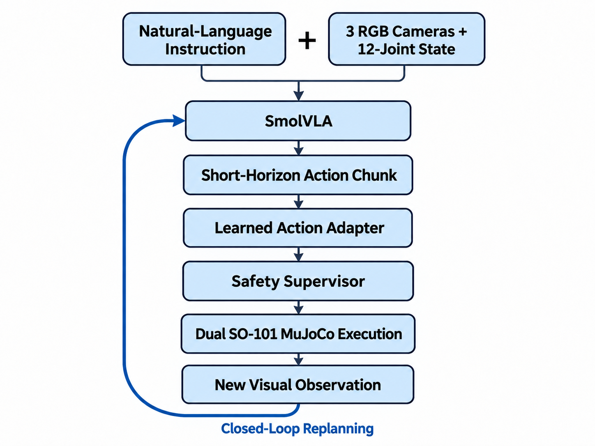
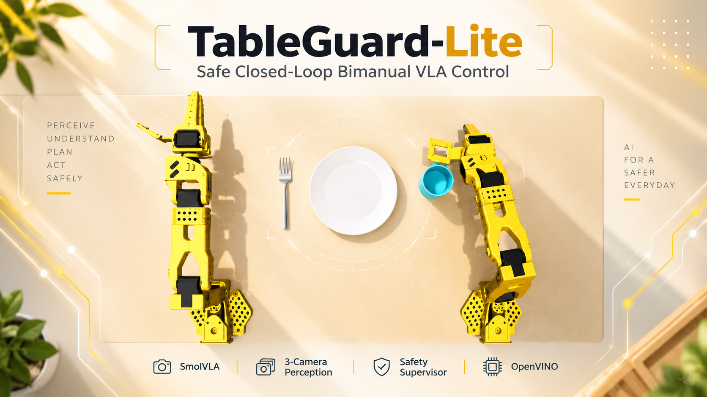

# TableGuard-Lite

## Safe Closed-Loop Bimanual VLA Control for Robotic Table Setting

TableGuard-Lite is a safety-aware closed-loop Vision-Language-Action (VLA) system for bimanual robotic table setting. It combines natural-language instructions, three RGB camera views, a 12-joint robot state, SmolVLA action prediction, runtime safety supervision, recovery-oriented learning, a learned residual action adapter, and OpenVINO deployment.

The project focuses on a practical Physical AI question:

> How can a language-conditioned bimanual robot execute learned actions while detecting, containing, and learning from unsafe closed-loop behavior?

---

## Task

The robot receives the instruction:

> **First place the cup to the right of the plate. Then place the fork to the left of the plate. Keep the plate centered.**

The target scene requires:

- cup moved approximately **+25 mm to the right**;
- fork moved approximately **−25 mm to the left**;
- plate preserved near its original position;
- safe dual-arm execution without unexpected robot/environment contact.

---

## System

### Inputs
- Top RGB camera
- Left wrist RGB camera
- Right wrist RGB camera
- 12-joint robot state
- Natural-language instruction

### Policy
- **SmolVLA / LeRobot**
- 12-dimensional bimanual action
- 20-step predicted action chunk
- First 10 learned steps executed before fresh replanning
- 50 ms simulated execution horizon before replanning

### Safety supervisor
Runtime checks include:

- joint-rate limit;
- unexpected robot/environment contacts;
- collision monitoring;
- scene/object preservation checks.

The safety constraints are not disabled during learned evaluation.

### Recovery-oriented learning
Failure states from learned closed-loop rollouts are reused for targeted fine-tuning. The final recovery stage also trains a learned residual action adapter using successful expert sequences and real closed-loop failure states.

---

## Verified Results

| Capability | Status |
|---|---|
| Dual SO-101 MuJoCo environment | ✅ Verified |
| Three-camera perception | ✅ Verified |
| Natural-language + 12-joint SmolVLA pipeline | ✅ Verified |
| Closed-loop replanning | ✅ Verified |
| Runtime safety supervisor | ✅ Verified |
| Full scripted/expert reference task | ✅ PASS |
| Recovery-oriented fine-tuning | ✅ Verified |
| Learned residual action adapter | ✅ Verified |
| OpenVINO model export / numerical parity | ✅ PASS |
| Intel CPU inference | ✅ Verified |
| Full end-to-end learned bimanual completion | ⚠️ Not yet achieved |

### Closed-loop robustness

Targeted recovery training progressively extended safe learned execution before the runtime guard intervened:

| Learned evaluation | Safe simulated execution before guard |
|---|---:|
| Initial full-task rollout | **7.77 s** |
| Anti-regression repair | **11.77 s** |
| Actual-state recovery | **14.32 s** |
| Learned residual action adapter | **15.07 s** |

This is an improvement of approximately **94%** from the first to the final learned evaluation while preserving the safety constraints.

### Learned residual action adapter

The final adapter was trained using:

- **556** full-task expert/reference sequences;
- **48** actual closed-loop recovery sequences from the learned policy;
- **12,080** step-level adapter training examples.

Normalized residual RMSE:

- before learned adapter: **0.5449**
- after learned adapter: **0.2529**
- reduction: **53.6%**

The adapter uses only the current 12-joint state and current SmolVLA action chunk at execution time. It does not use object coordinates, phase labels, IK, expert playback, or waypoint substitution.

### Final learned evaluation

The final learned rollout:

- used the 7701-update SmolVLA checkpoint plus the learned residual action adapter;
- received three RGB camera views, 12-joint state, and the language instruction;
- completed **302 policy calls**;
- ran for approximately **15.07 s simulated time** before the safety supervisor stopped an unexpected `development_table / right_camera_box2` contact;
- therefore has `task_success = False`.

This rollout is evidence of closed-loop learned control and active safety supervision, not full learned task completion.

---
## Quantitative Results

Recovery-oriented training progressively improved safe closed-loop execution
while keeping the original safety constraints active.

<p align="center">
  
</p>

### Closed-Loop Safety Progress

| Evaluation Stage | Safe Execution Before Guard |
|---|---:|
| Initial full-task rollout | **7.77 s** |
| Anti-regression repair | **11.77 s** |
| Actual-state recovery | **14.32 s** |
| Learned residual action adapter | **15.07 s** |

**Overall improvement:** approximately **94%** from the initial learned rollout to the final learned evaluation.

### Learned Action Adapter

- Expert/reference sequences: **556**
- Actual closed-loop recovery sequences: **48**
- Step-level training examples: **12,080**
- Residual RMSE before adapter: **0.5449**
- Residual RMSE after adapter: **0.2529**
- RMSE reduction: **53.6%**
- Final learned rollout policy calls: **302**

> The final full learned bimanual task was not completed successfully; the safety supervisor stopped execution after detecting unexpected contact.
> 
## Reference Task

A complete expert/scripted reference sequence successfully performs:

1. cup grasp;
2. cup lift;
3. cup transfer approximately +25 mm right;
4. cup placement and release;
5. fork grasp;
6. table-supported fork slide approximately −25 mm left;
7. fork release;
8. plate preservation.

The reference trajectory is engineering/training evidence and is **not labeled as learned VLA success**.

---

## OpenVINO / Intel Deployment

The project includes verified OpenVINO export and numerical-parity checks.

The final 59X2 deployment path successfully verified:

- OpenVINO conversion;
- CPU inference;
- numerical parity;
- standalone IR loading.

For transparency, the final 59X2 OpenVINO checkpoint did **not** improve CPU latency over its PyTorch baseline. A separate earlier verified checkpoint showed approximately **1.39×** median CPU speedup. These results are kept distinct.

---
## System Architecture

<p align="center">
  
</p>

TableGuard-Lite combines natural-language instructions, three RGB camera views,
a 12-joint robot state, SmolVLA action prediction, a learned action adapter,
runtime safety supervision, and closed-loop replanning for dual SO-101
manipulation in MuJoCo.

## Architecture

```text
Natural-Language Instruction
          +
3 RGB Cameras + 12-Joint State
          ↓
       SmolVLA
          ↓
 Short-Horizon Action Chunk
          ↓
 Learned Action Adapter
          ↓
   Safety Supervisor
          ↓
Dual SO-101 Robot Execution
          ↓
 New Visual Observation
          ↺
   Closed-Loop Replanning
```
# TableGuard-Lite

### Safe Closed-Loop Bimanual VLA Control for Robotic Table Setting

<p align="center">
  
</p>

**TableGuard-Lite** is a safety-aware closed-loop Vision-Language-Action system
for bimanual robotic table setting using SmolVLA, three-camera perception,
dual SO-101 manipulation in MuJoCo, recovery-oriented learning, runtime safety
supervision, and OpenVINO deployment.
---

## Repository Structure

```text
tableguard/
    Core environment, control, safety, and VLA integration

scripts/
    Training, evaluation, rollout, and deployment utilities

configs/
    Reproducible experiment configuration

tests/
    Project tests

integrations/
    VLA / OpenVINO integration helpers

artifacts/
    Keep only small representative evidence in the public repository

results/
    Compact result summaries and figures

docs/
    Architecture, demo, and submission documentation
```

Large model checkpoints, caches, raw frame dumps, temporary training runs, and private machine-specific data should not be committed to the public repository.

---

## Limitations

- Full learned end-to-end cup-and-fork completion has not yet been achieved.
- Long-horizon bimanual behavior still exhibits action drift and accumulated prediction error.
- Current validation is in MuJoCo simulation.
- The learned safety/recovery pipeline currently stops unsafe contact rather than guaranteeing proactive task recovery.
- Further inference optimization is needed for lower-latency deployment.

---

## Future Work

- achieve robust full learned bimanual completion from reset;
- expand recovery datasets with more diverse failure states;
- add temporal/history-aware VLA control;
- move from stop-based safety to proactive learned recovery;
- transfer the system to physical dual SO-101 hardware;
- optimize VLA inference for lower-latency Intel edge deployment;
- generalize from table setting to broader multi-object household manipulation.

---

## Team

### Syeda Fiza Rubab — Team Leader
**Role:** Project Idea, System Design, and Core Development

- Proposed the TableGuard-Lite project concept
- Led the overall technical direction and system architecture
- Implemented the main project code and experimentation pipeline
- Developed the bimanual MuJoCo environment, SmolVLA control, safety supervision, recovery learning, and deployment workflow
- Coordinated the final hackathon project development

### Rana Zain
**Role:** Verification, Code Support, GitHub, and Presentation

- Supported code verification and implementation checks
- Reviewed project outputs and experimental results
- Managed GitHub repository updates and project organization
- Contributed to presentation preparation
- Supported final technical validation

### Saira Asghar
**Role:** Presentation and Submission

- Prepared and refined presentation materials
- Supported visual organization of project results
- Assisted with hackathon submission content
- Managed final submission preparation and media organization

---

Our team combined technical development, verification, presentation, and submission work to deliver **TableGuard-Lite** as a safety-aware closed-loop bimanual VLA system for Physical AI.

## Project Message

> **TableGuard-Lite is designed not to hide VLA failures, but to detect, contain, and learn from them — providing a practical foundation for safer, recoverable, and verifiable Physical AI.**


